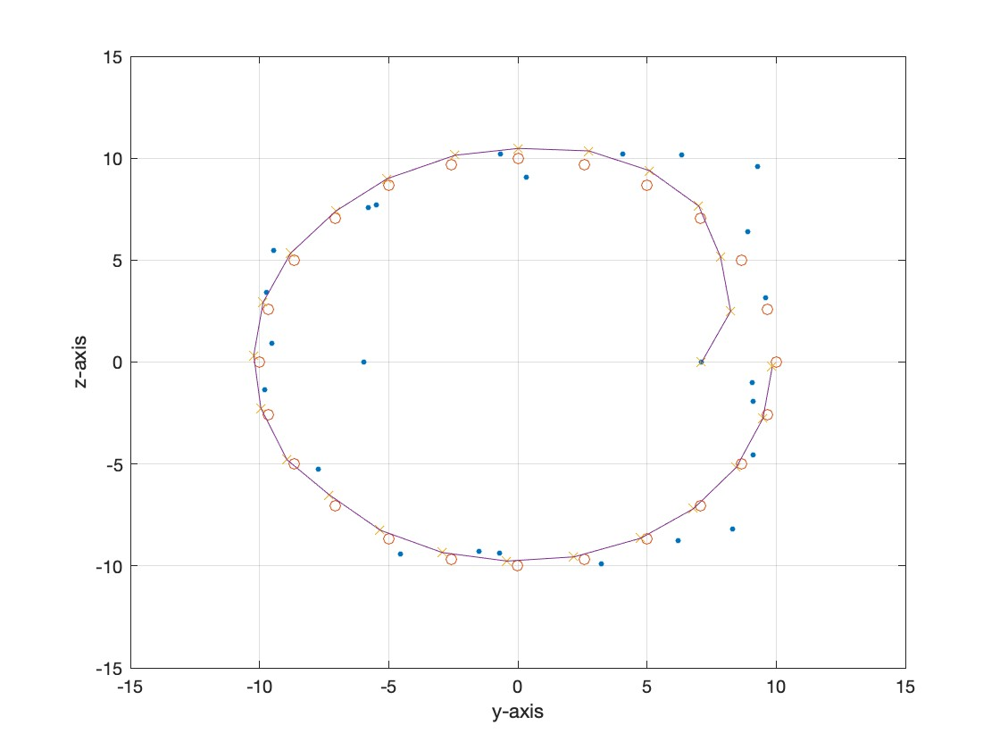

# NUS-EE5103-Project

This repository is for the projects of EE5103 Computer Control System in NUS.

It contains three parts using Kalman Filter algorithm to compute and simulate three different discrete time state-space models. In the third part, rotation matrix is used to construct true model for the system and Kalman Filter is used to estimate the states and compare with the ground truth trajectory.

## Usage

### With MATLAB Desktop

For three different projects, just type `run` button in MATLAB Desktop.

### Without MATLAB Desktop (Run in Linux or MacOS terminal)

First change your current directory to this repositiory's root path.

#### Project 1

Run:

```./project1```

#### Project 2

Run:

```./project1```

#### Project 3

Run:

```./project1```

## Demo for Project3



More details can be found in `report.pdf`.